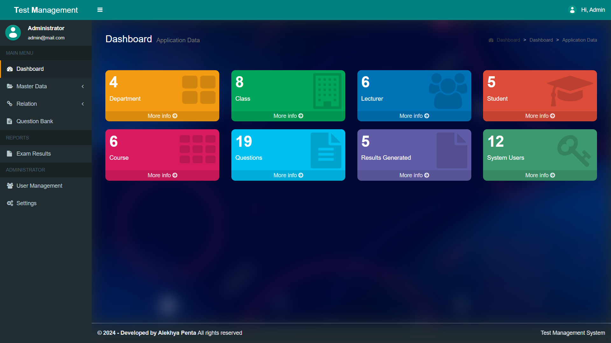
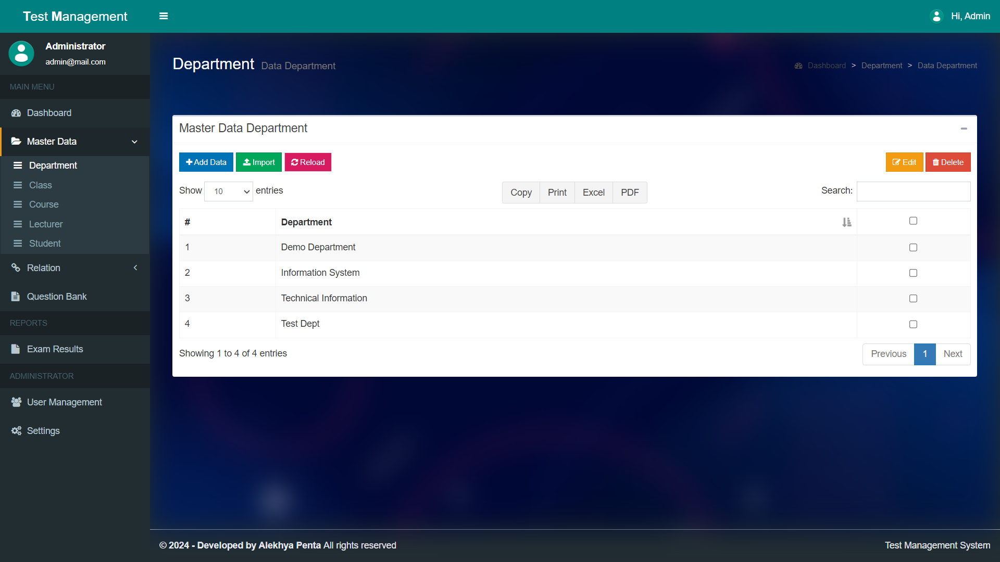
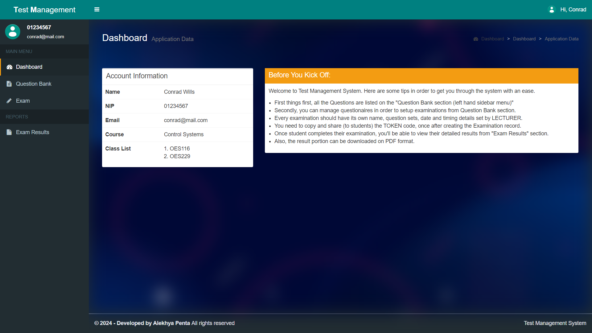
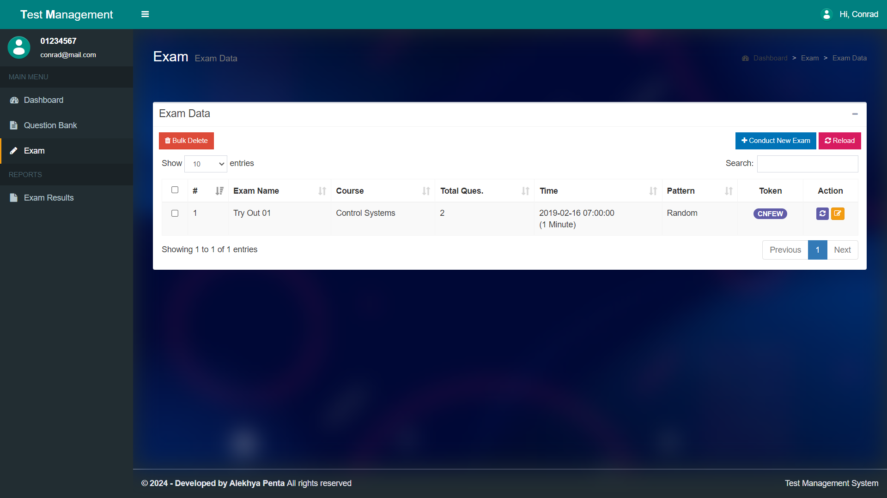
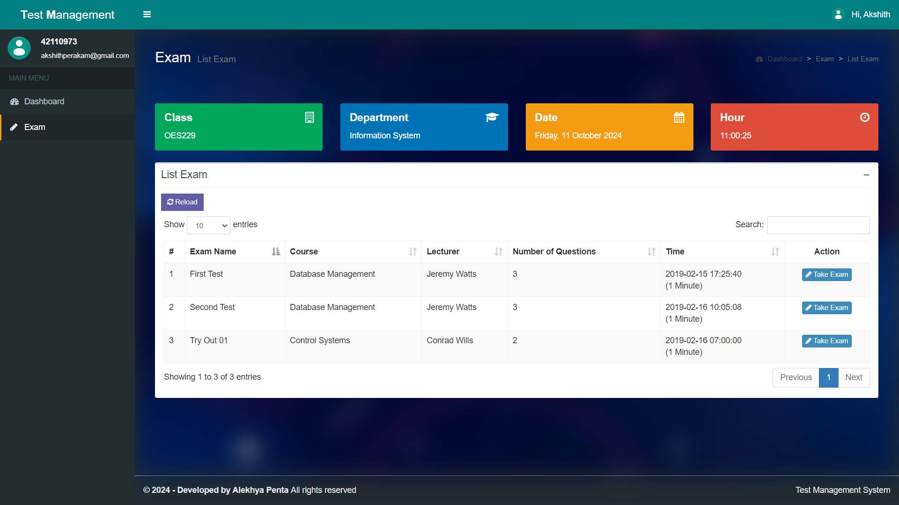
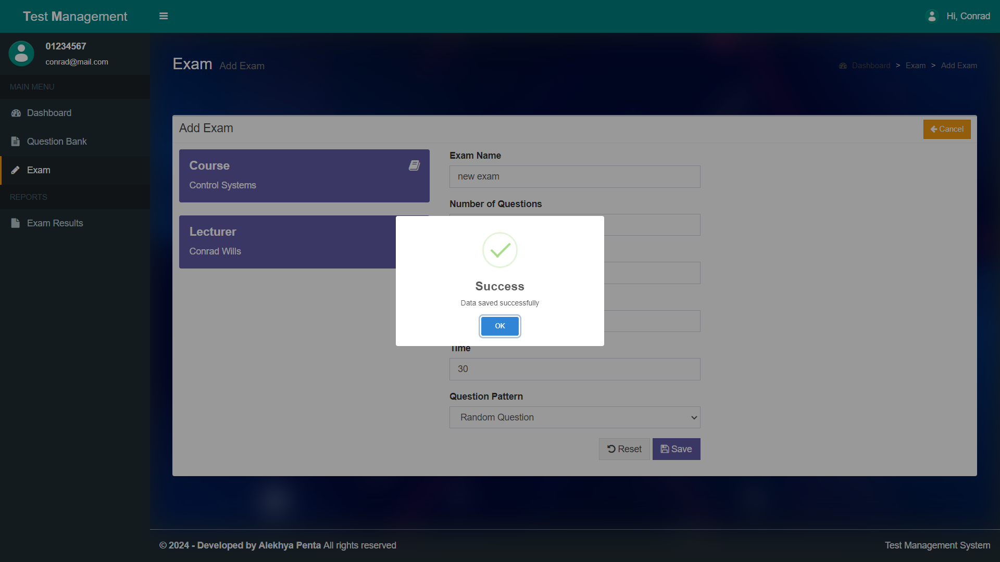
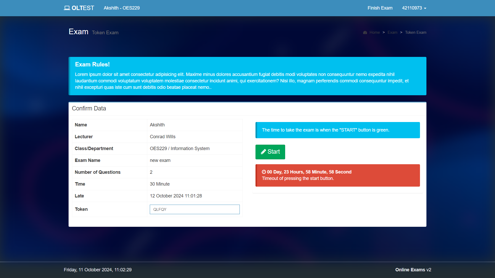
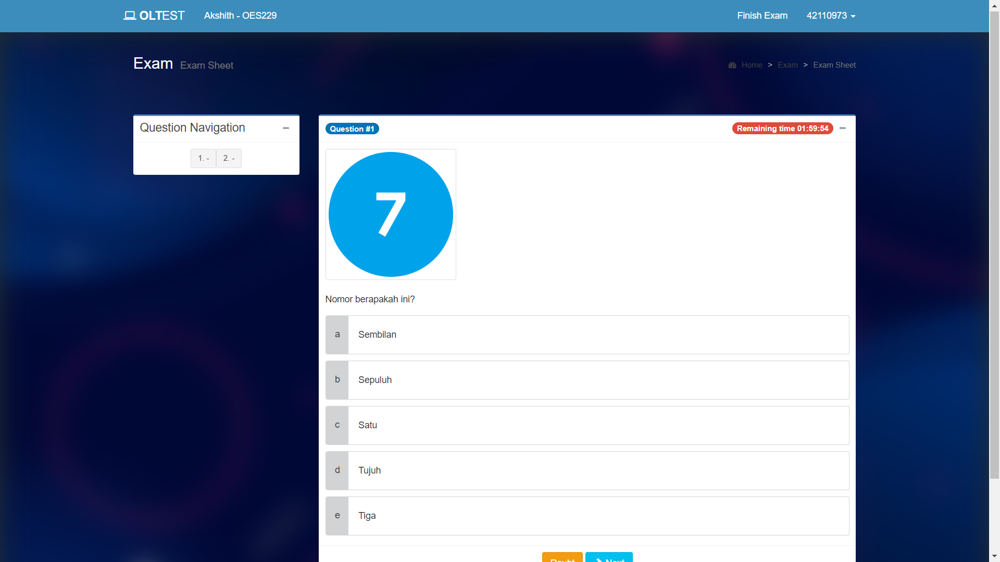

# Online Test Management System

> **Warning**: Due to the large number of files and folders, the project has been compressed into a `.zip` file for easier distribution.

The **Online Test Management System** is built using the CodeIgniter PHP framework, providing an efficient and user-friendly platform to manage online tests, quizzes, and evaluations. It leverages MySQL for secure database management and ensures a responsive design across devices.

Admin Login Details email: admin@mail.com pwd: Password@123

## Developed By
Alekhya Penta

## Features
- **User Authentication**: Secure login and registration for multiple user roles including students, lecturers, and admins.
- **Test Management**: Admins and lecturers can create, edit, and delete online tests and quizzes.
- **Responsive Design**: Optimized for mobile, tablet, and desktop views.
- **Multiple User Roles**: Supports different user roles such as students (for taking tests), lecturers (for managing tests), and admins (for overseeing the entire system).
- **Result Tracking**: View test results and detailed analytics for each user.
- **Form Validation**: Ensures the accuracy and security of data input during tests.

## Technologies
- **Frontend**: HTML, CSS, JavaScript
- **Backend**: PHP (CodeIgniter Framework)
- **Database**: MySQL
- **Development Tools**: XAMPP, phpMyAdmin

- ## This are some Outputs of the Project:

